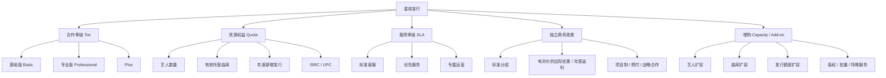
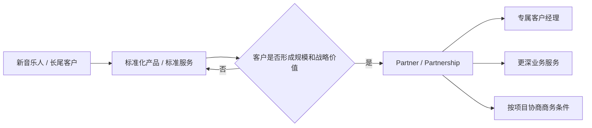
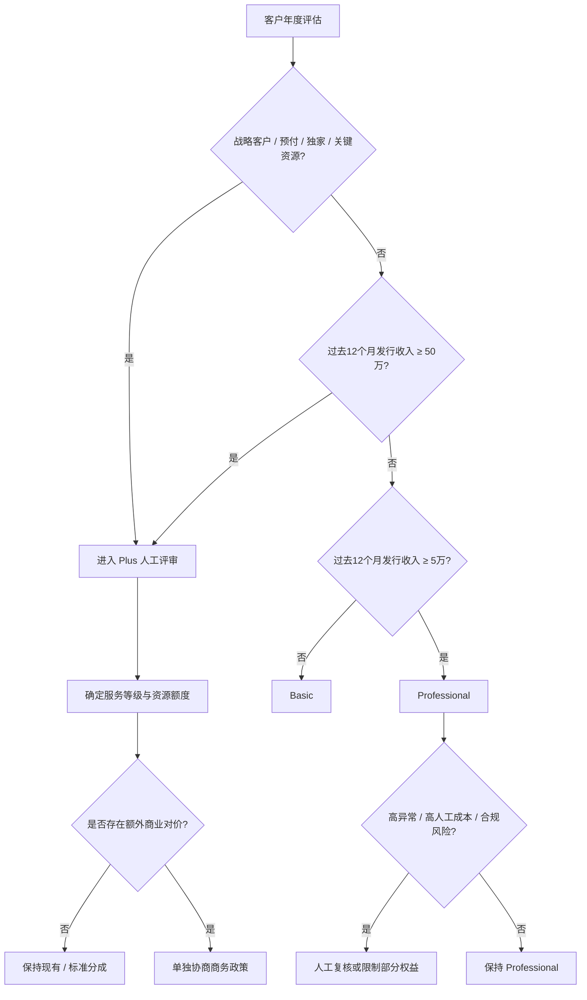
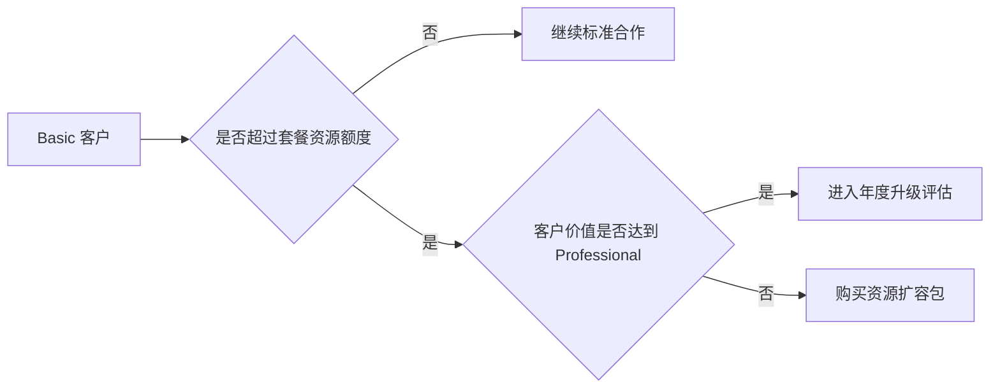
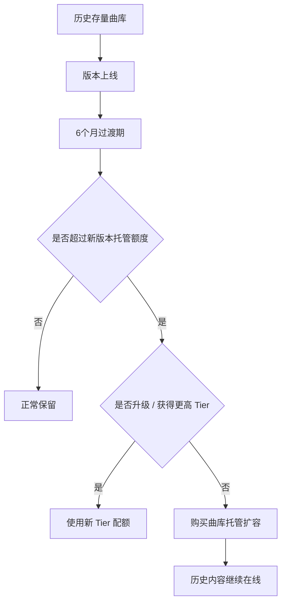
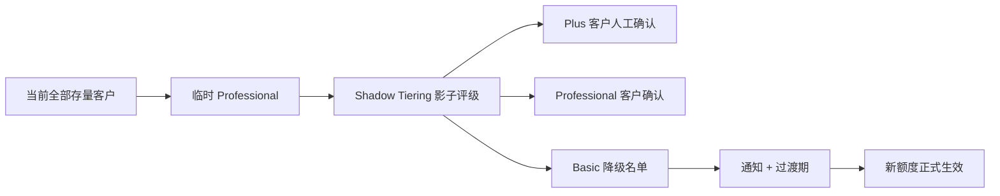
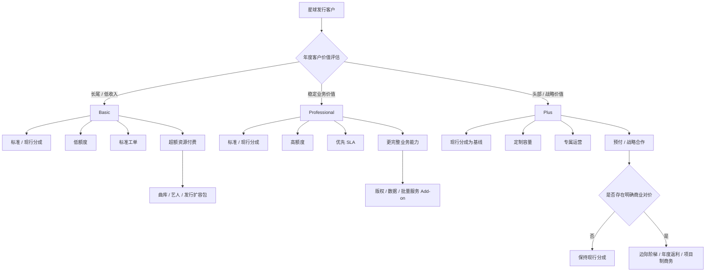

# 星球发行商业模式 v1.0

> 日期：2026-09-09  
> 状态：商业模式设计基线 / 待运营、财务、法务联合校准  
> 适用范围：星球发行（看见音乐直接运营的合作发行产品），不适用于星球发行·企业版和 AI 音乐发行。  
> 说明：本文先确定商业结构、分层逻辑、权益模型和建议试行区间；最终具体分成、额度与增购价格需在成本测算、客户回放和合同评估后冻结。  
> 2026-09-09 修正：**Basic / Professional / Plus 是合作与服务等级，不与平台分成自动绑定；分成作为独立商务政策处理。**

---

## 1. 结论先行

星球发行应继续保持“合作发行”属性，不改造成订阅制 DIY 发行产品。

推荐的商业模型是：



核心原则：

> **版本决定合作深度和服务资源，额度决定资源消耗，增购解决超额需求；分成政策独立于版本，只在客户提供明确商业对价时调整。**

星球发行不建议统一收取基础年费。原因是：

1. 星球发行本质仍然是合作发行，收入来源应以发行分成为主；
2. AI 音乐发行已经承担“按次 / 订阅付费自助发行”的产品角色；
3. 如果星球发行也改成统一年费订阅，会与 AI 音乐发行产生明显产品重叠；
4. 真正需要解决的不是所有客户都要收费，而是“大量资源占用但长期低价值”的客户需要承担超额资源成本。

因此建议采用：

> **无统一年费 + 标准收益分成 + 分层额度 + 超额扩容收费 + 高级增值服务收费 + 条件化商务优惠。**

商业目标不是“用头部让利换长尾降本”，而是：

> **保住头部分成收入基本盘 + 治理长尾成本 + 增加超额资源与增值服务收入。**

---

# 2. 为什么不能直接照搬 DistroKid / Ditto

海外 DIY 发行产品的主流模式，大致分成三种：

### 模式 A：订阅费 + 无限发行

代表：DistroKid、Ditto、TuneCore、Amuse。

共同点：

- 用户先支付年费；
- 再获得无限或较高发行额度；
- 常用“Primary Artist / Artist Slots”作为分档维度；
- 更高等级提供多艺人、数据、发行日期、优先支持等能力。

这套模式之所以敢“无限发行”，前提是平台先从订阅中获得固定收入。

### 模式 B：免费 / 分成 与 付费 / 低分成并存

代表：RouteNote。

典型逻辑是：

```text
小客户：不付前置费用，平台拿更高分成
        ↓
客户开始赚钱
        ↓
付费升级，客户保留更多版税
```

### 模式 C：DIY 产品 + 高价值 Partnership

代表：Symphonic、UnitedMasters。

尤其值得星球发行参考的是它们对客户服务形态的分层，而不是简单复制“等级越高平台分成越低”的逻辑：



这与星球发行现状非常接近，但星球发行已经有独立的 AI 自助发行产品，因此不需要再把 Basic 做成另一个 DistroKid。

星球发行更适合的是：

> **Basic = 标准化合作发行**  
> **Professional = 专业合作发行**  
> **Plus = 深度 Partnership**

海外竞品的价格和分成结构只作为参考，不能直接套用到星球发行。星球发行当前收入高度集中于少数头部 CP，任何针对头部客户的统一自动降点都会显著损害平台收入。

---

# 3. 三个版本的产品定位

## 3.1 基础版 Basic

### 一句话定义

> 面向独立音乐人、小型厂牌和低收入长尾 CP 的标准化合作发行服务。

### 产品目标

- 保证用户仍可以正常完成数字发行；
- 限制长期低价值账户无边界占用曲库、编码、发行与人工服务资源；
- 让大多数服务通过标准流程和工单完成；
- 对超出标准合作范围的资源占用进行收费。

### Basic 不应该是什么

- 不是“阉割版发行”；
- 不是不能发行主流 DSP；
- 不是为了逼用户付费而人为制造大量功能障碍；
- 不是 AI 音乐发行的替代品。

---

## 3.2 专业版 Professional

### 一句话定义

> 面向已经形成稳定发行规模和稳定收益的音乐人、厂牌、版权方的标准专业合作层。

### 产品目标

- 给真正持续产生业务价值的客户更大的业务容量；
- 提供更高服务响应优先级；
- 提供更完整的批量、数据与运营支持；
- 保持相对标准化，不轻易进入一户一议；
- **升级到 Professional 本身不自动触发分成让利。**

Professional 应成为星球发行真正的“中坚客户层”，而不是所有存量用户长期默认拥有的套餐。

---

## 3.3 Plus

### 一句话定义

> 面向头部厂牌、版权公司、聚合发行商和战略客户的深度发行 Partnership。

### 产品目标

- 维护少量、高价值、高影响力合作伙伴；
- 支持专属运营、专属沟通机制和定制服务；
- 支持预付、独家、战略合作、项目制商务条件等灵活合作；
- 在客户提供明确长期价值或商业承诺时，允许协商特殊分成；
- 通过深度合作换取长期高价值关系，而不是通过自动让利购买客户规模。

Plus 不是通过付款即可购买的会员，也不是“自动低分成层”。

---

# 4. 推荐的准入与年度评估模型

## 4.1 核心原则：收入是主指标，规模不是“自动升级理由”

客户曲库大、艺人多，只能说明资源消耗大，并不代表客户一定值得进入更高等级。

例如：

```text
5 万首曲库 + 很低收入
≠ Professional

500 首精品曲库 + 很高收入
= 可能是 Professional / Plus
```

因此建议采用：

> **1 个主指标 + 4 个辅助指标 + Plus 人工评审。**

### 主指标

**过去连续 12 个月发行收入（Rolling 12M Distribution Revenue）**

建议统一定义为：

> 看见实际收到、进入分账计算口径的数字发行可分配收入，避免用流水、播放量或客户自行申报收入作为判断依据。

### 辅助指标

1. **有效曲库规模与单位曲库产出**；
2. **过去 12 个月有效新增发行量与持续活跃度**；
3. **合作深度**：独家、核心目录、长期合作、特殊渠道价值等；
4. **运营质量**：版权合规、发行通过率、异常率、人工服务消耗等。

战略价值作为 Plus 人工评审中的独立因素，不通过公式机械计算。

---

## 4.2 建议试行门槛

> 以下为第一版建议值，用于 Shadow Tiering 回放，不建议直接作为正式合同数字上线。

### Basic

默认等级。

满足以下情况通常进入 Basic：

- 新注册 / 新签约客户；
- 过去 12 个月发行收入 **低于 5 万元**；
- 尚未形成稳定发行收入；
- 长期低活跃或低商业价值账户。

### Professional

建议达到以下主条件之一后进入评估：

- 过去 12 个月发行收入 **≥ 5 万元**；
- 或已经形成持续业务规模，并经业务评审确认具备稳定增长价值。

同时要求：

- 版权 / 合规表现正常；
- 发行质量与异常率在合理范围；
- 不存在明显“高资源占用、低商业产出”的失衡情况。

### Plus

采用 **邀请 / 评审制**，不做自动升级。

以下情况进入 Plus 候选池：

- 过去 12 个月发行收入 **≥ 50 万元**；
- 或处于收入头部客户群；
- 或属于重要厂牌、版权公司、聚合发行商；
- 或存在独家、预付、战略合作、关键内容资源等特殊价值。

进入 Plus 只代表更深的合作与服务关系，不自动代表平台降低分成。



---

# 5. 三档权益与建议试行额度

> 额度是第一版产品假设，最终应拿全量 CP 数据进行回放后调整。

| 维度 | Basic | Professional | Plus |
|---|---:|---:|---:|
| 标准数字发行 | 支持 | 支持 | 支持 |
| Primary Artist / 主要艺人 | 5 | 100 | 定制 |
| 有效托管曲库 | 500 首 | 10,000 首 | 定制 |
| 年度新增发行 Release | 50 个 | 1,000 个 | 定制 |
| 年度新增 Track | 100 首 | 3,000 首 | 定制 |
| 免费 ISRC | 100 个/年 | 3,000 个/年 | 定制 |
| 免费 UPC | 50 个/年 | 1,000 个/年 | 定制 |
| 标准 DSP | 全部标准渠道 | 全部标准渠道 | 全部 + 特殊合作能力 |
| 月度版税 / 报表 | 支持 | 支持 | 支持 |
| 销售分析 | 基础 | 完整 | 完整 + 定制 |
| 批量发行 / 批量导入 | 有限 / 标准模板 | 支持 | 支持 + 大批量专项服务 |
| 客服方式 | 标准工单 | 优先工单 | 专属运营 / 对接群 |
| 首次响应目标 | 3 个工作日内 | 1 个工作日内 | 重点问题 4 工作小时内 |
| 单次改单 / 下架 | 标准申请流程 | 优先处理 | 专属协调 |
| 版权问题 | 标准材料提交 / 工单 | 优先协调 | 运营 + 法务协调 |
| 宣发推广 | 独立购买 | 独立购买 / 可享优惠 | 可配置战略权益 |
| 分成政策 | 标准 / 现合同政策 | **不因升级自动降点** | **现合同为基线；有对价再一户一议** |
| 预付 | 不提供 | 个案评估 | 支持定制 |

### 为什么建议 Basic 是 5 个艺人而不是 1 个

星球发行不是纯个人 DIY 工具，它长期同时服务独立音乐人、小厂牌和 CP。

Basic 如果只允许 1 个艺人，会过早逼迫大量正常小厂牌进入 Professional，与“合作等级由客户价值决定”的原则冲突。

因此建议先用 **5 个 Primary Artist** 作为 Basic 的试行值，再通过真实客户分布回放决定是否调整为 3 / 5 / 10。

---

# 6. 分成政策设计：与 Tier 解耦

> 以下统一使用“看见：CP”口径。  
> 本章节的核心规则：**Tier 管服务和资源，分成是独立商务政策。**

## 6.1 为什么不能把高等级自动设计成低分成

当前发行收入高度集中于少量头部 CP。如果头部客户占整体发行收入 90%，而看见当前标准数字发行分成为 20%，则：

```text
当前：
100 × 20% = 20
```

如果仅因为客户进入 Professional / Plus，就把头部 90% 的收入统一降到 15%：

```text
90 × 15% + 10 × 20% = 15.5
```

平台发行分成收入下降 **22.5%**。

如果头部统一降到 10%，则：

```text
90 × 10% + 10 × 20% = 11
```

平台发行分成收入下降 **45%**。

因此：

> **客户越赚钱，版本越高，不代表平台应该自动拿得越少。**

星球发行本轮拆分的目标是优化成本结构、提高客户分层运营效率和创造增量收入，而不是主动削弱头部收入基本盘。

---

## 6.2 数字发行分成

当前标准合作以 **20%：80%** 为主要基线，部分头部客户已有单独商务条件。

推荐政策：

| Tier | 数字发行分成原则 |
|---|---|
| Basic | 标准分成 / 现行合同政策 |
| Professional | 原则上继续标准分成 / 现行合同政策；**升级本身不降点** |
| Plus | 现行合同为基线；只有存在明确商业对价时才单独协商 |

### 哪些情况可以讨论更优分成

更优分成必须换取能够增加长期价值、降低风险或扩大业务规模的明确承诺，例如：

- 独家发行或更高独家比例；
- 最低年度收入承诺；
- 最低发行量或核心曲库迁移承诺；
- 2–3 年长期合作期限；
- 重要版权目录或战略内容合作；
- 预付且具备明确回收机制；
- 更大的商用授权合作范围；
- 跨产品合作带来的新增收入；
- 其他经测算可覆盖让利成本的商业价值。

原则：

> **没有对价，不降低平台分成。**

---

## 6.3 更推荐的优惠机制

如果确实需要通过分成激励客户增长，优先采用下面三种方式，而不是直接永久降低全量分成。

### A. 边际阶梯分成

只对超过约定门槛的增量收入优惠。

示例：

```text
0–50 万       平台 20%
50–200 万     仅超出 50 万的部分按 18%
200 万以上    仅超出 200 万的部分按 15%
```

这样可以激励增量，同时保护已有收入基盘。

### B. 年度返利

全年先按标准分成执行，在客户完成约定目标后，再返还满足条件部分的 1–3 个点。

返利可以绑定：

- 收入目标；
- 独家率；
- 合同续期；
- 核心曲库迁移；
- 合规质量；
- 其他战略目标。

### C. 项目制 / 合同制优惠

Plus 的特殊条件设置明确：

- 有效期；
- 收入底线；
- 合作范围；
- 独家 / 资源承诺；
- 退出条件；
- 恢复标准分成机制。

---

## 6.4 商用授权

现有主要逻辑为：

> 先扣除约定运营成本，再按合作比例分成。

商用授权的人力、销售、法务与履约服务属性高于纯数字发行，因此同样不应为了制造版本差异而自动降低平台分成。

推荐政策：

| Tier | 商用授权政策 |
|---|---|
| Basic | 标准合同政策 |
| Professional | 原则上继续标准合同政策；升级不自动改变分成 |
| Plus | 现合同为基线，可针对具体项目、预付、独家或战略合作单独约定 |

如果具体项目存在较高销售、制作、履约、法务等成本，应继续允许项目级单独约定，而不是完全被 Tier 固化。

---

# 7. 为什么 Basic 不通过“提高分成”解决低价值客户

低价值客户真正的问题通常不是：

> 平台分成比例太低。

而是：

> 客户几乎没有收益，但占用很多曲库、存储、传输和人工成本。

对一个一年只产生 100 元收入但拥有 1 万首内容的 CP：

- 看见拿 20% = 20 元；
- 改成拿 30% = 30 元；
- 多出的 10 元并不能解决运营问题。

因此成本治理必须主要发生在：

> **额度、资源扩容和人工服务标准化。**

而不是简单把 Basic 的分成提高到 30% 或 40%。

同理，Professional / Plus 的客户价值治理也不能简单通过降低分成完成。真正应该优化的是：

- 客户留存；
- 核心内容合作深度；
- 独家和长期合作；
- 增量发行收入；
- 服务效率；
- 跨产品商业价值。

---

# 8. 超额扩容与 Add-on

## 8.1 设计原则

客户业务量大，不等于客户价值高。

因此：

> **不能通过“买 Plus”解决容量问题。**

低收入大曲库客户仍然可以是 Basic，但需要购买扩容。



---

## 8.2 建议首批扩容包

以下为建议试行价带，不在 v1.0 锁死最终价格：

| 扩容项 | 建议单位 | 建议年价区间 |
|---|---:|---:|
| 艺人扩容包 | +5 个 Primary Artist | ¥99–199 / 年 |
| 曲库托管包 | +1,000 首有效 Track | ¥299–499 / 年 |
| 年度发行扩容 | +100 首新增 Track | ¥199–299 / 年 |
| 大批量导入 / 曲库迁移 | 按项目 | 单独报价 |
| 高级 Metadata 整理 | 按批次 / 项目 | 单独报价 |
| 版权登记 | 按登记服务 | 独立付费 |
| 特殊渠道 / 特殊履约 | 按服务 | 单独报价 |

### ISRC / UPC 不建议作为主要扩容商品

标准发行额度内：

> **自动包含发行所需 ISRC / UPC。**

只有以下情况再独立计费：

- 非星发发行用途；
- 批量提前申请；
- 单独编码服务；
- 特殊项目。

这样既能落实 ISRC / UPC 限量，又避免用户把商业模型理解成“以前免费的编码现在开始单卖”。

---

# 9. 存量大曲库治理

这是本次商业模式重构能否真正降低成本的关键。

## 9.1 不建议直接下架历史内容

历史已经成功发行的内容，不应因为版本变化直接批量下架。

原因包括：

- 客户体验；
- 合同关系；
- DSP 状态管理；
- 历史收益连续性；
- 潜在版权 / 业务风险。

## 9.2 建议采用 Grandfathering + 托管额度



建议：

- 历史在线内容继续保持发行状态；
- 首期只对“新增发行”和“新增艺人”开始实施硬额度；
- 历史曲库提供 6 个月左右过渡期；
- 过渡期后，超出免费托管量的部分进入年度曲库托管包；
- 对长期没有收益的历史源文件，可以配合底层存储策略迁移到更低成本的归档存储，但不等于 DSP 下架。

---

# 10. 服务等级与人工成本治理

当前大量成本来自系统之外：

- 微信上找运营；
- 临时改单；
- 下架请求；
- 版权争议；
- 财务问题；
- 人工查发行状态。

因此三档版本必须建立明确服务边界。

## Basic

```text
标准工单
↓
统一材料
↓
标准审核
↓
后台处理
↓
前台查看状态
```

目标：**尽量减少一对一沟通。**

## Professional

在同一工单体系上提供：

- 优先队列；
- 更快响应；
- 更复杂问题的人工介入；
- 必要时的运营协调。

## Plus

提供：

- 专属运营；
- 对接群；
- 重点发行跟进；
- 批量 / 特殊问题专项处理；
- 法务、财务、渠道等内部协调。

### SLA 只承诺“看见首次响应 / 处理动作”，不要承诺 DSP 最终完成时间

DSP 审核、改单、下架的最终完成时间往往不完全由看见控制，因此用户协议和产品页面需要明确区分：

- 看见首次响应时间；
- 看见提交渠道时间；
- DSP 最终处理时间。

---

# 11. 现有用户迁移方案

产品基线明确要求：

> 现有用户默认属于 Professional，之后再评估。

建议实际执行为四步。



## 第一步：上线即刻

- 所有存量客户前台显示 / 后台记录为 Professional；
- 新注册客户从 Basic 起步；
- 不立即改变历史分成和历史内容状态。

## 第二步：1–3 个结算周期 Shadow Tiering

后台按照新模型跑客户评级：

- 年度发行收入；
- 曲库规模；
- 新增发行；
- 服务消耗；
- 合作深度；
- 战略价值。

验证 5 万 / 50 万等门槛是否合理。

## 第三步：确认 Plus 与 Professional

- 先人工确认 Plus；
- 再锁定 Professional 标准客户；
- 剩余客户进入 Basic 降级池。

## 第四步：Basic 过渡

- 给即将降级客户明确展示当前使用量；
- 告知新额度；
- 提供清理 / 扩容 / 联系运营路径；
- 资源限制先作用于新增操作；
- Tier 变化不自动改变分成；如需调整商务条件，在合同续签 / 补充协议时单独执行。

---

# 12. 推荐的整体商业关系



星球发行的收入结构因此应理解为：

```text
发行分成收入基本盘
        +
长尾超额容量收入
        +
增值服务收入
        +
战略合作增量收入
        -
经过测算且有对价的商务让利
```

而不是：

```text
版本越高
→ 平台分成越低
→ 主动降低头部营收
```

---

# 13. 为什么这套模式适合当前星球发行

它同时解决五个问题。

## 13.1 不破坏合作发行定位

不要求所有音乐人先交年费，星球发行仍然通过客户成功和发行收入共同获益。

## 13.2 能真正治理低价值大曲库

不再让“几乎没有收入但拥有大量内容”的 CP 无上限消耗平台资源。

## 13.3 保护头部收入基本盘

头部客户贡献了绝大部分发行收入，因此 Professional / Plus 不再通过自动降分成制造产品差异。让利必须换取可量化的新增价值。

## 13.4 给头部客户真正的 Partnership

Plus 不再只是事实上的“微信群 + 特殊合同”，而成为正式产品等级；其价值来自专属服务、资源能力与商务灵活度，而不是单一分成折扣。

## 13.5 与另外两条产品线保持边界

```text
星球发行
= 合作发行 / Revenue Share + Capacity + Add-on

星球发行·企业版
= 企业基础设施 / SaaS + API Fee

AI 音乐发行
= 付费自助发行 / Per Release + Channel + Term / Subscription
```

三个产品的商业模式不会互相打架。

---

# 14. 下一步需要的数据回放

v1.0 建议值不能直接进入正式合同。

下一步应使用真实 CP 数据完成一轮模拟：

1. 按 Rolling 12M 收入把客户划为 `<5万 / 5–20万 / 20–50万 / ≥50万`；
2. 叠加每个 CP 的有效曲库数量；
3. 叠加艺人数量；
4. 叠加过去 12 个月新增发行 Track / Release；
5. 统计不同候选配额会影响多少客户；
6. 测算 Basic 超额曲库可能产生的年度扩容收入；
7. **在所有 Tier 默认保持现行分成的前提下，测算平台整体收入基线；**
8. **单独模拟边际阶梯、年度返利和项目制让利，确认每一种让利必须换取多少增量收入才不损害平台收益；**
9. 单独回放头部客户现有合同，识别哪些特殊分成已经有明确商业对价，哪些只是历史政策；
10. 对比“降本 + 扩容增收”与“商务让利”的净收益影响。

输出应包括：

- 各 Tier 客户数量；
- 各 Tier 贡献收入；
- 各 Tier 曲库占用；
- 被 Basic 配额影响的客户比例；
- 预计扩容收入；
- 现行分成下的平台收入基线；
- 各种条件化优惠方案对平台收入 / 毛利的影响；
- 每种分成优惠对应的盈亏平衡增量收入；
- 迁移风险客户名单（内部，不进入公开仓库）。

完成这轮回放以后，再冻结 `commercial-model-v1.1` 的正式门槛、额度、扩容价格和商务政策。

---

# 15. 行业参考

本方案参考的核心行业模式：

- DistroKid：年度订阅、Artist Slots、不同版本能力分层；
- Ditto Music：年度订阅、1/2/多艺人分层、优先支持；
- TuneCore：年度订阅 + Pay-per-release、多艺人和分级客服 SLA；
- Amuse：年度订阅、按艺人数分层、Professional 提供优先服务；
- RouteNote：免费分成模式与付费保留更多收益模式并行；
- UnitedMasters：付费标准产品 + 邀请制 Partner；
- Symphonic：Starter Fee-based DIY + Partner Percentage-based Managed Distribution。

这些竞品用于验证“资源分层、服务分层、DIY 与 Partnership 分层”是行业通用模式，但**不直接用于决定星球发行的分成阶梯**。星球发行的分成政策必须结合自身高度集中的客户收入结构设计。

公开参考：

- https://distrokid.com/pricing/
- https://support.distrokid.com/hc/en-us/articles/6184398375571-Which-Features-are-Available-for-each-Plan
- https://dittomusic.com/en/pricing
- https://www.tunecore.com/pricing
- https://www.amuse.io/en/pricing/
- https://support.routenote.com/kb-article/how-much-does-routenote-cost/
- https://comms.unitedmasters.com/en/pricing
- https://symphonic.com/pricing/
- https://symphonic.com/partner/
