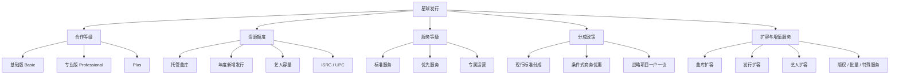
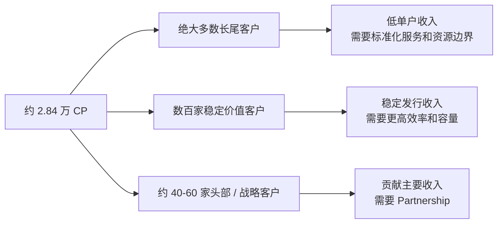
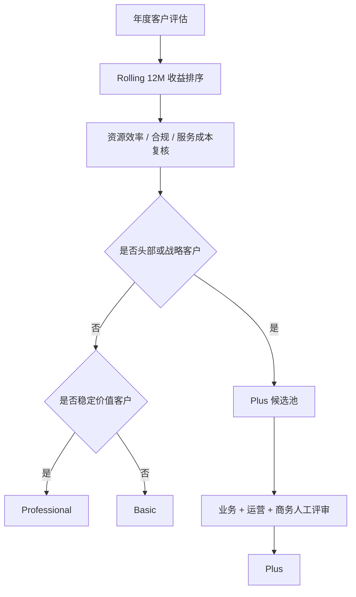
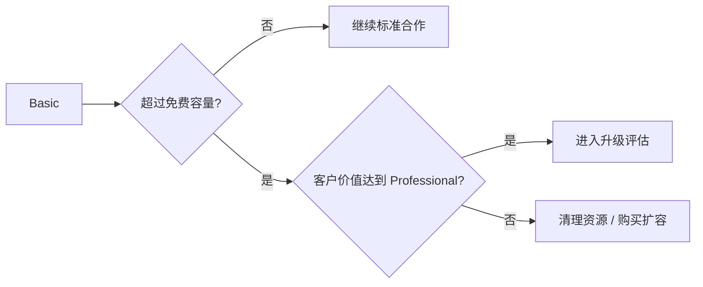
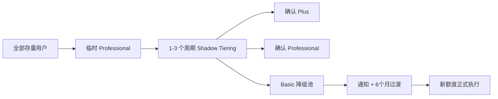
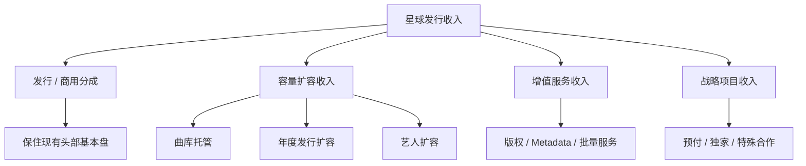
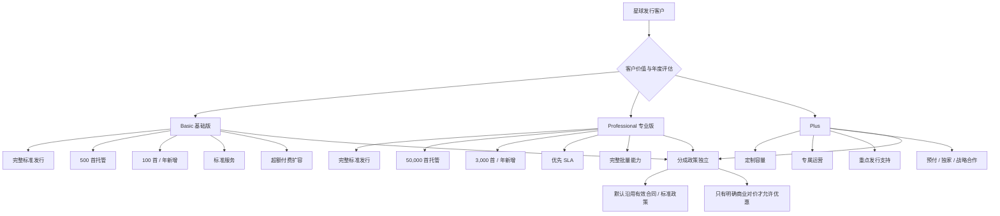

# 星球发行商业模式 v1.1

> 日期：2026-09-09  
> 状态：**商业模式正式基线 / Phase 2A 收口版**  
> 适用范围：星球发行（看见音乐直接运营的合作发行产品）  
> 不适用于：星球发行·企业版、AI 音乐发行  
> 数据基础：现有星球发行客户结构、2026-09-09 CP 收益/曲库/新增歌曲/艺人数据、历史成本资料、现行合同与服务方式、海外发行竞品研究。

---

# 1. 一句话结论

星球发行继续保持 **合作发行（Managed Distribution）** 定位，不改造成 DistroKid 式付费 DIY 产品。

未来商业模式由五部分组成：



核心原则：

> **Tier 管合作深度，Quota 管资源成本，SLA 管人工成本，分成政策独立于 Tier，扩容和 Add-on 负责新增收入。**

商业目标不是降低头部客户的分成收入来补贴长尾，而是：

> **保住头部分成基本盘 + 治理高资源低产出账户 + 降低长尾服务成本 + 增加容量与增值服务收入。**

---

# 2. 为什么必须拆成三个等级

当前星球发行的问题不是核心发行能力不足，而是不同价值客户长期共享近似的资源和人工服务投入。

根据本轮 CP 数据：

- CP 总量约 **2.84 万**；
- 当前歌曲总量约 **3,228 万首**；
- 2025-09-01 以来新增歌曲约 **704 万首**；
- 收益高度集中，Top 50 贡献约 **78.8%**，Top 100 约 **88.7%**，Top 300 约 **97.1%**；
- 少数“低收益 + 超大曲库”客户占用了非常高比例的存储和发行资源。

因此星球发行不是一个“平均客户模型”。真实结构更接近：



三个等级的作用因此分别是：

- **Basic：治理长尾成本，同时保证完整标准发行能力；**
- **Professional：服务真正稳定、有持续商业价值的中坚客户；**
- **Plus：把今天事实存在的头部客户深度合作正式产品化。**

---

# 3. 最重要的商业决策：Tier 与分成彻底解耦

## 3.1 不允许“升级 = 自动降低看见分成”

星球发行收益高度集中在头部客户。

如果头部客户占 90% 收入，而平台分成从 20% 自动降到 15%，平台整体发行分成收入会显著下降；如果进一步降到 10%，对收入基盘破坏更大。

因此正式规则为：

> **Basic / Professional / Plus 不自动对应不同分成比例。**

客户升级首先获得：

- 更高资源额度；
- 更高 SLA；
- 更优服务方式；
- 更强运营能力；
- 更灵活商务空间。

而不是自动获得更低的平台分成。

## 3.2 分成政策作为独立商务层

数字发行和商用授权原则上继续沿用客户当前有效合同或标准合同政策。

只有客户提供明确商业对价时，才允许讨论更优分成，例如：

- 独家发行或更高独家比例；
- 最低年度收入承诺；
- 核心目录迁移；
- 2–3 年长期合作；
- 重要版权目录；
- 预付且具备明确回收机制；
- 更大的商用授权合作范围；
- 跨产品合作带来的新增收入；
- 战略级合作资源。

原则：

> **没有对价，不降低平台分成。**

## 3.3 更优分成优先使用三种机制

### A. 边际阶梯

只对超过约定门槛后的**增量收入**优惠，不追溯降低全部历史收入。

### B. 年度返利

先按标准合同执行，完成年度收入、独家、续约等承诺后，再进行约定返利。

### C. 项目 / 合同制优惠

Plus 的预付、重点版权、特殊合作采用一户一议，并设置有效期、收入底线、退出机制和恢复标准分成条款。

---

# 4. 三档正式产品定义

## 4.1 基础版 Basic

### 定位

> **标准化合作发行。**

面向：

- 新注册 / 新签约用户；
- 独立音乐人；
- 小型厂牌 / 小型 CP；
- 长期低收入客户；
- 高资源占用但商业产出不足的客户。

Basic 仍然拥有完整的标准发行闭环，不是“阉割版”。

核心目标：

> **让绝大多数正常长尾用户几乎无感，同时把极少数高资源消耗账户纳入容量治理。**

---

## 4.2 专业版 Professional

### 定位

> **稳定业务客户的专业合作层。**

面向：

- 有持续发行收入的音乐人 / 厂牌；
- 稳定版权公司；
- 有持续发行量、较好运营质量的 CP；
- 对批量效率、数据和服务响应有更高需求的客户。

核心目标：

> **给真正持续创造业务价值的客户更高容量和更高服务效率，但保持标准化。**

Professional 不是付费可以买到的会员，也不因为曲库大就自动升级。

---

## 4.3 Plus

### 定位

> **头部和战略客户的深度发行 Partnership。**

面向：

- 中大型厂牌；
- 大型版权公司；
- 聚合发行商；
- 重要独家客户；
- 预付客户；
- 对看见具有明显战略价值的合作伙伴。

Plus 不公开售卖，采用邀请 / 评审制。

核心目标：

> **维护少量、贡献主要收入和战略价值的客户，提供专属运营与定制商务合作。**

---

# 5. 正式准入与年度评估规则

## 5.1 长期规则

正式系统应使用 **Rolling 12M CP 收益**作为主要价值指标，同时叠加：

1. 当前有效曲库；
2. 过去 12 个月新增发行；
3. 单位曲库商业产出；
4. 合规 / 版权质量；
5. 人工服务消耗；
6. 独家、预付、战略价值。

但 Tier 不由单一公式完全自动决定。



## 5.2 首轮上线采用“相对排名 + 人工复核”

由于现有数据最可靠的是 CP 每月收益及当前资源规模，首轮不强行冻结“年收入 5 万 / 50 万”等绝对金额门槛。

首轮 Shadow Tiering 建议：

### Plus 候选池

- 收益排序 **Top 50** 作为第一批候选；
- 再补充独家、预付、重要版权、战略客户；
- 最终由业务、运营、商务联合确认；
- 目标规模控制在约 **40–60 家**。

### Professional 候选池

- 原则上从收益排序 **Top 51–300** 中产生；
- 需剔除明显“高资源占用、低商业产出”或高风险账户；
- 目标规模约 **200–300 家**。

### Basic

- 其余绝大多数客户；
- 以及虽曲库很大但商业产出不足、不应因“规模大”自动升级的客户。

根据当前数据回放，一套合理的初始结构大致是：

| Tier | 客户规模 | 收益占比（观察值） | 角色 |
|---|---:|---:|---|
| Basic | 约 28,000 | 约 4% | 长尾 / 资源治理 |
| Professional | 约 200–300 | 约 17% | 稳定中坚客户 |
| Plus | 约 40–60 | 约 79% | 头部 / 战略合作 |

> 该结构用于首轮实施，不意味着未来永远固定为 Top N。系统数据稳定后应转为 Rolling 12M 绝对门槛 + 排名双重校准。

---

# 6. 三档正式权益与容量基线

## 6.1 v1.1 建议额度

| 维度 | Basic | Professional | Plus |
|---|---:|---:|---:|
| 标准数字发行 | 支持 | 支持 | 支持 |
| 有效托管曲库 | **500 首** | **50,000 首** | 定制 |
| 年度新增 Track | **100 首/年** | **3,000 首/年** | 定制 |
| 年度新增 Release | **50 个/年** | **1,000 个/年** | 定制 |
| ISRC | 随年度新增 Track 自动分配，最多 100 | 随年度新增 Track 自动分配，最多 3,000 | 定制 |
| UPC | 随年度新增 Release 自动分配，最多 50 | 随年度新增 Release 自动分配，最多 1,000 | 定制 |
| 活跃主要艺人 | **5 个候选值** | **100 个候选值** | 定制 |
| 标准 DSP | 标准合作渠道 | 标准合作渠道 | 标准 + 特殊合作能力 |
| 报表 / 版税 | 月度 | 月度 | 月度 / 定制 |
| 批量能力 | 标准模板 | 完整批量能力 | 专项 / 大批量支持 |
| 服务方式 | 标准工单 | 优先服务 | 专属运营 / 对接群 |
| 商务政策 | 标准合同 | 标准合同 + 可评估特殊项目 | 一户一议 |

### 为什么 Basic 定 500 首

当前数据表明，500 首额度对绝大多数 Basic 客户几乎没有影响，但可以覆盖真正需要治理的大曲库长尾账户。

在本轮模拟中：

- 约 **0.55%** 的 Basic 客户会超过 500 首；
- 但这些账户合计拥有约 **1,389 万首超额歌曲**。

因此 500 首具有明显的 Pareto 效果：

> **几乎不打扰正常小客户，却可以命中绝大多数长尾资源浪费。**

### 为什么年度新增定 100 首

本轮数据中，100 首 / 年同样只影响极少数 Basic 客户，但可以覆盖非常高比例的异常批量新增。

因此：

> **Basic = 500 首存量托管 + 100 首年度新增**

作为 v1.1 首发容量基线。

### Professional 为什么提高到 50,000 首

Professional 是稳定业务客户，不应因为正常中大型曲库频繁购买小额扩容包。

当前 Professional 候选群的平均曲库规模已明显高于 Basic，因此 v1.1 将此前 10,000 首调整为 **50,000 首**，让扩容主要命中真正大规模的聚合商 / 大版权目录，而不是正常中坚厂牌。

---

# 7. 艺人数：定义产品规则，但暂缓硬执行

海外发行产品普遍使用 Artist Slot 分层，这一维度仍然适合星球发行。

但当前数据库中的 `artist_count` 只是历史 Artist 记录数，不能直接等同于“有效主要艺人”。

因此 v1.1 规定：

- 产品权益目标值：Basic 5 个、Professional 100 个；
- **首期不根据现有 artist_count 直接阻断用户；**
- 先定义新的“活跃主要艺人”商业口径。

建议“活跃主要艺人”定义为：

> 过去 12 个月存在有效发行作品、作为 Primary Artist 出现、且当前归属于该 CP 的艺人。

新指标上线并完成一次 Shadow Measurement 后，再正式执行艺人限额。

---

# 8. 扩容收费：真正承担成本治理和新增收入

## 8.1 原则

> **曲库大 ≠ 客户价值高。**

因此客户不能通过“资源用得多”自动升级 Professional / Plus。

如果一个 Basic 客户拥有大量内容，但收益不足以进入 Professional：



## 8.2 首轮扩容包建议价

> 以下价格作为 v1.1 首发商业基线，正式上线前允许财务在 ±20% 范围内校准，但不改变计费单位和结构。

| 扩容项 | 单位 | 建议价格 | 计费方式 |
|---|---:|---:|---|
| 曲库托管扩容 | +1,000 首有效 Track | **¥399 / 年** | 每年续费 |
| 年度发行扩容 | +100 首新增 Track | **¥299 / 年** | 当年度有效 |
| ISRC | 随发行扩容自动增加 | 不单独收费 | 与 Track 额度绑定 |
| UPC | 随 Release / 发行扩容增加 | 不单独作为核心商品 | 与发行额度绑定 |
| 艺人扩容 | +5 个活跃主要艺人 | **¥99 / 年** | 指标正式启用后执行 |
| 大批量曲库迁移 | 项目制 | **¥1,999 起** | 一次性 |
| 高级 Metadata 整理 | 项目制 | 单独报价 | 一次性 |
| 特殊渠道 / 特殊履约 | 项目制 | 单独报价 | 一次性 |
| 版权登记 / 其他版权服务 | 独立产品 | 按对应产品价格 | 单独结算 |

### ISRC / UPC 的对外表达

不要把商业模式包装成“开始卖 ISRC / UPC”。

正确表达是：

> **套餐包含一定年度发行额度，额度内自动提供发行所需 ISRC / UPC。**

这样既实现编码数量控制，也不会破坏用户对基础发行能力的理解。

---

# 9. 服务等级与人工成本治理

版本差异必须真正体现在服务方式，而不只是显示一个等级标签。

| 服务维度 | Basic | Professional | Plus |
|---|---|---|---|
| 服务入口 | 标准工单 / 客服 | 优先工单 | 专属运营 / 群 |
| 首次响应目标 | **3 个工作日内** | **1 个工作日内** | 重点事项 **4 工作小时内** |
| 改资料 | 标准申请 | 优先队列 | 专属协调 |
| 下架 | 标准申请 | 优先队列 | 专属协调 |
| 版权问题 | 标准材料 + 工单 | 优先协调 | 运营 + 法务协调 |
| 财务 / 提现问题 | 标准流程 | 优先处理 | 专属协调 |
| 批量 / 特殊事务 | Add-on / 项目制 | 支持 | 专项支持 |

注意：SLA 只承诺看见侧响应和处理动作，**不承诺 DSP 最终审核、下架或改单完成时间**。

## Basic 的系统建设重点

Basic 要真正降低成本，必须把今天散落在微信、邮件和人工沟通中的事务产品化：

```text
改单申请
下架申请
版权问题提交
财务问题
发行异常
        ↓
统一 Service Case
        ↓
标准材料 / 状态 / SLA
```

否则只限制曲库数量，人工成本仍然降不下来。

---

# 10. 历史存量曲库治理

本次升级的目的不是大规模下架历史作品。

正式原则：

> **DSP 已上线内容与“平台托管容量”分开处理。**

## 10.1 历史在线内容

- 原则上不因降级直接批量下架；
- 保持历史收益连续性；
- 下架仍按正常版权 / 合同流程执行。

## 10.2 平台历史源文件和资产托管

对超过新 Tier 免费托管量的客户：

1. 提供过渡期；
2. 可以购买曲库托管扩容；
3. 不购买时，可将历史低频源文件迁往低成本归档存储；
4. 限制新增资源继续超过套餐；
5. 如未来需要恢复归档文件，可按实际能力设计恢复服务费。

这使“降低存储成本”不必等价于“把 DSP 上作品下架”。

---

# 11. 存量用户迁移政策

用户基线要求：

> **现有用户上线时默认属于 Professional，之后再根据年度发行收入、曲库规模和服务需求评估。**

v1.1 保留这一原则，并将实施分为四步：



## Step 1：版本发布

- 所有存量用户暂时标记为 Professional；
- 所有新注册客户从 Basic 开始；
- 不改变历史有效合同分成；
- 不直接处理历史上线内容。

## Step 2：影子评级

运行 1–3 个完整业务 / 结算周期：

- 收益排名；
- 曲库规模；
- 新增发行；
- 服务成本；
- 合规质量；
- 战略价值。

## Step 3：确认 Plus 与 Professional

- 先确认约 40–60 家 Plus；
- 再确认约 200–300 家 Professional；
- 其余进入 Basic。

## Step 4：Basic 过渡

建议给存量降级客户 **6 个月过渡期**：

- 前台展示当前使用量；
- 明确未来免费额度；
- 提供清理、扩容、联系运营入口；
- 新增发行额度可以较早开始执行；
- 历史托管超额在过渡期后再收费 / 归档。

---

# 12. 星球发行的新收入结构

v1.1 之后，星球发行的收入来源不再只有版税分成。



商业公式可以表达为：

> **星球发行贡献 = 现有发行分成收入 + 新增容量收入 + Add-on 收入 + 战略项目收入 − 存储 / 传输 / 人工 / 运营成本。**

本轮商业模式重构必须满足一个底线：

> **不能因为 Tier 升级规则主动让平台核心发行分成收入下降。**

---

# 13. 三档最终对外关系



---

# 14. v1.1 需要工程支持的最小商业能力

要让这套商业模式真正运行，系统至少需要补齐：

1. **Tier**：Basic / Professional / Plus；
2. **Entitlement**：各版本权益；
3. **Quota**：曲库、年度新增、艺人、ISRC / UPC；
4. **Usage Meter**：当前使用量、年度使用量；
5. **Capacity Pack**：扩容包购买与有效期；
6. **Order / Payment**：扩容和 Add-on 支付；
7. **Service Case**：改单、下架、版权、财务、异常等工单；
8. **SLA Priority**：不同 Tier 的处理优先级；
9. **Annual Tier Review**：年度评级与人工调整；
10. **Grandfathering**：存量客户和历史资源过渡规则。

---

# 15. 商业运行的核心 KPI

上线后不只看“多少人降成 Basic”，应持续观察：

| KPI | 目标方向 |
|---|---|
| 发行分成收入 | 不因 Tier 政策主动下降 |
| Top 50 / Plus 留存率 | 高位稳定 |
| Professional 收入贡献 | 稳定 / 增长 |
| Basic 单 CP 平均资源成本 | 下降 |
| 高资源低收益账户曲库占用 | 明显下降 |
| 曲库 / 发行扩容收入 | 新增 |
| Basic 人工服务次数 | 下降 |
| 工单线上化率 | 上升 |
| Plus 专属服务满意度 | 稳定 |
| 存量降级投诉率 | 可控 |

---

# 16. v1.1 正式决策清单

本版本正式冻结以下商业原则：

1. **星球发行继续是合作发行，不改统一订阅收费。**
2. **Basic / Professional / Plus 是合作等级，不是可直接购买的会员。**
3. **Tier 不自动绑定分成优惠。**
4. **现行发行分成是核心收入基本盘，不主动通过升级机制降点。**
5. **分成优惠必须换取明确商业对价。**
6. **Basic 首发容量基线为 500 首托管 + 100 首年度新增。**
7. **Professional 首发容量基线为 50,000 首托管 + 3,000 首年度新增。**
8. **Plus 容量和商务政策一户一议。**
9. **ISRC / UPC 跟随发行额度，不作为主要独立收费商品。**
10. **艺人限额保留，但首期先定义“活跃主要艺人”指标，再硬执行。**
11. **高资源低产出客户不因曲库大自动升级，而应购买扩容或清理资源。**
12. **历史在线内容原则上不因降级直接下架；存储治理通过托管、归档和新增限制完成。**
13. **存量用户先临时 Professional，再通过 Shadow Tiering 迁移。**
14. **Plus 首轮候选约 40–60 家，Professional 约 200–300 家，其余主要进入 Basic。**
15. **商业模式的最终目标是：保收入、降成本、增容量收入、提升头部服务质量。**

---

# 17. 下一阶段

星球发行商业模式在 v1.1 已具备进入具体产品设计的条件。

后续不再继续扩展商业架构，下一步应进入：

> **星球发行具体产品形态设计：三个版本在前台如何呈现、额度如何展示、升级 / 扩容如何购买、服务入口如何重构，以及官网如何对外表达。**
