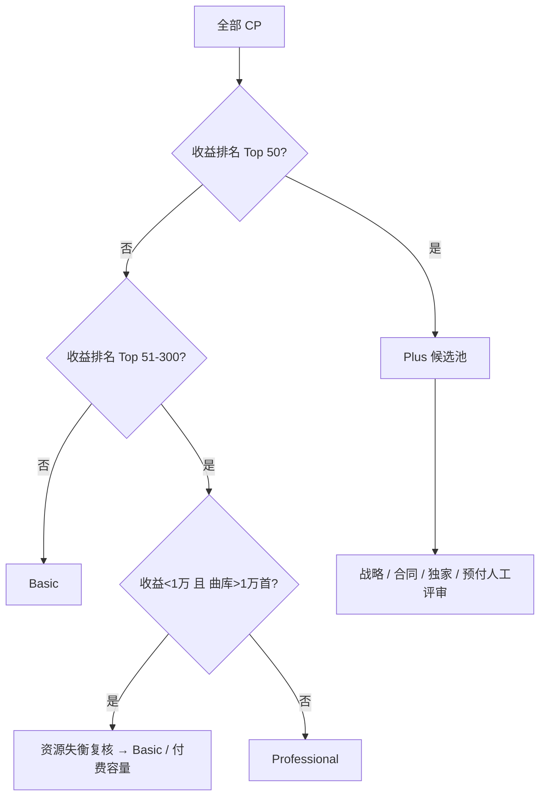

# 星球发行客户分层模拟（2026-09）

> 数据来源：`CP收益列表_0909.xlsx`，共 28,361 个 CP。  
> 说明：仓库为公开仓库，本文仅保留聚合统计和产品结论，不包含客户名称、逐户收益和原始明细。  
> 本文用于 Shadow Tiering / 商业模式校准，不作为正式合同规则。

---

## 1. 数据口径

从工作簿 `Query` Sheet 可以确认：

- `track_count`：`content.product_asset_info_star` 中当前未删除歌曲数量；
- `track_count_20250901`：上述歌曲中 `create_time >= 2025-09-01` 的数量，可作为近一年新增歌曲量的近似值；
- `artist_count`：`content.artist` 中当前未删除艺人记录数量；
- 月度收益：来自 `tenant_net_earning_amount`，按报表覆盖月份均摊，并根据汇率换算为人民币。

需要特别注意：

1. 2026-07、2026-08 只有少量 CP 有收益数据，明显存在报表回传滞后，因此本轮更适合用收益做相对排序，不建议据此直接冻结绝对年度收入门槛；
2. `artist_count` 是数据库艺人记录数，不等价于面向产品收费的 `Primary Artist Slot`，不能直接用它确定最终套餐艺人数；
3. `tenant_net_earning_amount` 最终对应“看见侧净收益 / CP 侧可分配收益 / 其他财务口径”仍需财务或数据团队确认，冻结绝对收入门槛前必须统一口径。

---

## 2. 整体规模

当前数据表现为：

- CP：28,361；
- 当前歌曲：约 3,228 万；
- 2025-09-01 后新增歌曲：约 704 万；
- 艺人记录：约 613 万。

这说明星球发行已经不是普通“音乐人发行工具”的量级，而是同时承载大量聚合曲库和历史资产的发行基础设施。

---

## 3. 收益集中度

收益高度集中：

| 客户范围 | 累计收益占比 |
|---|---:|
| Top 1 | 11.7% |
| Top 5 | 32.5% |
| Top 10 | 45.4% |
| Top 20 | 60.0% |
| **Top 50** | **78.8%** |
| Top 100 | 88.7% |
| Top 200 | 94.7% |
| Top 300 | 97.1% |
| Top 500 | 98.8% |

因此商业设计必须遵守：

> **不能通过给头部客户普遍降分成，来补贴长尾成本。**

头部收入基本盘必须优先保护。

---

## 4. 最关键发现：真正的问题不是“长尾人多”，而是少量低收益大曲库账户

单纯按收入看，大量 CP 没有或只有极少收益；但真正决定存储和发行成本的，是少数“收入低、曲库极大”的账户。

本轮定义一个简单的“严重资源失衡”观察组：

> **观察收益 < 1 万 + 当前曲库 > 1 万首**

结果：

- 只有约 50 个 CP；
- 却占全部当前曲库约 **42.6%**；
- 占近一年新增歌曲约 **44.0%**；
- 只贡献约 **1.24%** 的观察收益。

这组客户是本轮商业模式最需要治理的人群。

因此成本治理不能只做：

> Basic = 很多小音乐人

而必须同时覆盖：

> **低收益 + 高资源占用的大曲库 CP。**

---

## 5. 第一轮 Shadow Tiering 模拟

由于收益月份存在明显报表滞后，本轮不建议先用“5 万 / 50 万”这种绝对门槛，而采用相对排名 + 资源复核做模拟。

### 模拟规则



### 模拟结果

| Tier | CP 数 | CP 占比 | 收益占比 | 曲库占比 | 近一年新增占比 |
|---|---:|---:|---:|---:|---:|
| **Basic** | 28,078 | 99.0% | 4.1% | 43.6% | 46.0% |
| **Professional** | 233 | 0.8% | 17.1% | 13.7% | 4.1% |
| **Plus** | 50 | 0.2% | 78.8% | 42.7% | 49.9% |

这组结果与业务目标非常吻合：

- Plus：极少量头部 / 战略客户，贡献核心收入；
- Professional：少量稳定、高价值客户；
- Basic：承接绝大多数普通客户，同时承接需要治理的高资源低收益账户。

这不是最终人数，而是说明三档结构在真实数据上是成立的。

---

## 6. Basic 配额敏感性

### 6.1 当前曲库额度

如果 Basic 设置不同的免费托管曲库额度：

| Basic 曲库额度 | 受影响 Basic CP 占比 | 观察结论 |
|---|---:|---|
| 100 首 | 约 1.5% | 较严格 |
| 300 首 | 约 0.7% | 可行 |
| **500 首** | **约 0.55%** | **非常高效的成本治理点** |
| 1,000 首 | 约 0.4% | 更宽松 |
| 2,000 首 | 约 0.3% | 治理力度减弱 |

其中 **500 首**值得保留为第一候选值：

- 只影响约 0.55% 的 Basic 客户；
- 但超出 500 首部分合计约 1,389 万首；
- 即极少数账户占据了绝大多数需要治理的曲库。

因此：

> **500 首是目前数据最支持的 Basic 曲库候选值之一。**

但历史已发行曲库不能直接下架，应配合过渡期、历史托管政策和容量包。

---

### 6.2 年新增歌曲额度

Basic 年新增歌曲：

| 年新增额度 | 受影响 Basic CP 占比 |
|---|---:|
| 20 首 | 约 1.7% |
| 50 首 | 约 0.9% |
| **100 首** | **约 0.6%** |
| 200 首 | 约 0.4% |
| 500 首 | 约 0.2% |

`100 首 / 年` 同样是一个很强的候选值：

- 对绝大多数普通客户无感；
- 可以覆盖大规模高频入库账户；
- 与 ISRC 自动派发天然联动。

因此 Basic 可以先按：

> **年新增歌曲 100 首，ISRC 随发行额度自动派发。**

继续做下一轮验证。

---

## 7. 艺人数暂时不要锁死

当前 `artist_count` 是数据库 `content.artist` 的记录数。

数据中存在大量：

- 艺人记录数高于当前歌曲数的账户；
- 没有歌曲但已经建立艺人记录的账户。

因此它与 DistroKid 等产品里的 `Primary Artist Slot` 不是同一个指标。

结论：

> **Basic / Professional 确实应该限制“可管理主要艺人数量”，但不能直接使用本表的 `artist_count` 字段作为最终计费口径。**

下一步产品侧应重新定义：

- 有效主要艺人；
- 过去 12 个月有发行的艺人；
- 或 CP 当前实际管理的 Primary Artist Profile。

然后再决定 Basic 是 5、10 还是 20 个。

---

## 8. 对现有商业模式 v1.0 的数据修正建议

### 8.1 暂时撤掉绝对 5 万 / 50 万门槛

当前数据存在报表 lag，因此：

- `Professional >= 5 万` 会只留下极少数客户；
- `Plus >= 50 万` 更无法代表真实头部结构。

第一阶段更适合采用：

- Plus：Top 50 左右 + 战略人工评审；
- Professional：Top 300 左右的价值客户池，再做资源 / 合规 / 服务复核；
- Basic：其余客户 + 严重资源失衡客户。

待完整 12M 结算数据成熟后，再把排名规则转换成明确的年度收入门槛。

### 8.2 Tier 与容量继续分离

本次数据进一步证明：

> **客户收入价值和资源占用完全不是一回事。**

因此仍然坚持：

- Tier 决定合作等级、服务等级、SLA；
- Quota / Capacity 决定曲库、年度新增、艺人等资源使用；
- 高价值但大曲库客户可以保持 Pro / Plus，同时购买或获得定制容量；
- 低价值大曲库客户不能因为“曲库大”自动进入高等级。

### 8.3 分成政策继续独立

本次数据进一步验证头部集中度极高，因此：

> **Professional / Plus 不应自动降低看见分成。**

让利只能换取独家、最低收入承诺、长期合作、核心曲库、预付或其他明确商业对价。

---

## 9. 下一步还需要确认的两个数据口径

在把商业模式升级到 v1.1 前，还需确认：

1. `tenant_net_earning_amount` 的准确财务含义；
2. 获得一个报表已经完整回传的 12M 收益窗口，或者由数据侧直接输出 Rolling 12M 已结算收益。

确认这两点以后，就可以把当前“Top 50 / Top 300”的相对规则转换成正式的年度金额门槛，并做平台收入、存储成本、扩容收入和毛利回放。

---

## 10. 当前最值得保留的 v1.1 候选结论

```text
Basic
├─ 默认合作层
├─ 当前曲库候选：500 首
├─ 年新增歌曲候选：100 首
├─ 标准工单 / 标准 SLA
└─ 超额曲库 / 新增发行通过容量包治理

Professional
├─ 数百家以内的稳定价值客户
├─ 高于 Basic 的容量与 SLA
├─ 不自动降低分成
└─ 严重资源失衡账户需额外容量政策或人工复核

Plus
├─ 约 40–60 家头部 / 战略客户
├─ 邀请 / 人工评审
├─ 专属运营与定制容量
└─ 分成一户一议，但任何让利必须有商业对价
```

当前数据已经足以证明：

> **星球发行的三档商业模式应该围绕“保护头部收入 + 管住高资源低价值账户 + 标准化长尾服务”来设计。**
